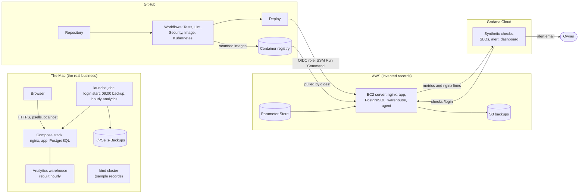
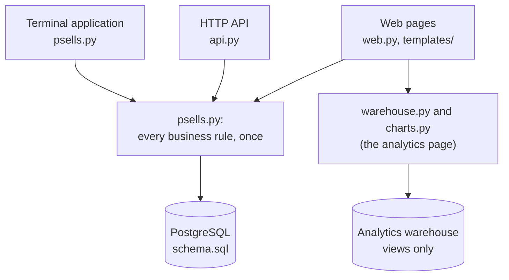
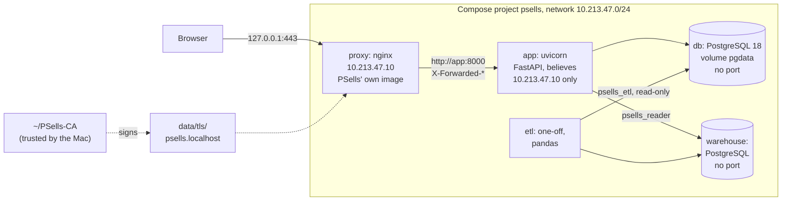
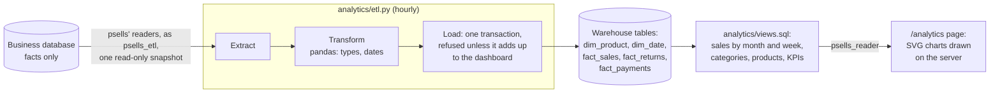
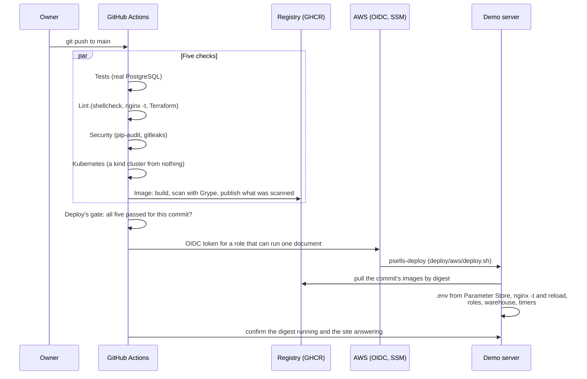
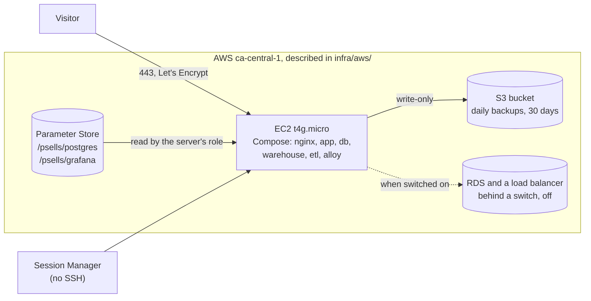
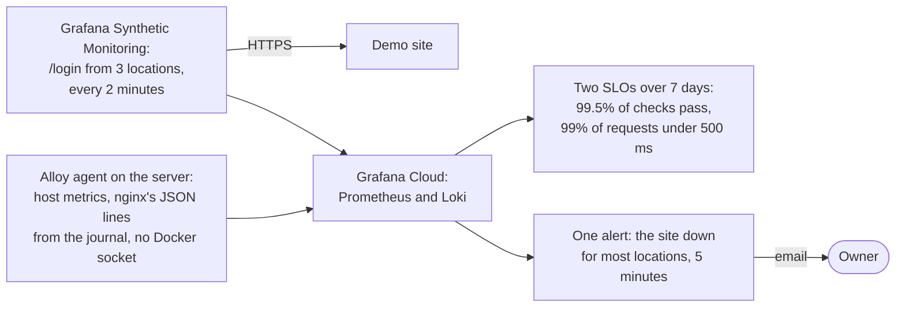
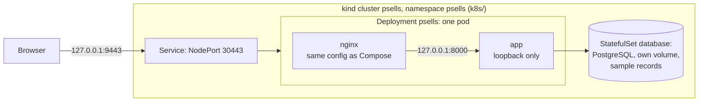

# PSells architecture

How the whole system fits together: what runs where, what talks to what, and
which file to open to see it. README.md says how to use each part,
RUNBOOK.md what to do when something needs doing or goes wrong, DECISIONS.md
why each part is the way it is, and DATA_MODEL.md what the data means.

PSells tracks a small reselling business: products held for sale, sales,
returns to the partner whose stock it is, and payments to that partner. It
runs for real on one Mac. A copy holding invented records runs on AWS as a
public demonstration, and the same images run on a local Kubernetes cluster.
Nothing real ever leaves the Mac.

## The whole system

Four places, each with one job:

| Where | What it holds | Who reaches it |
|---|---|---|
| The Mac | The real records, their backups, the real configuration | Its own browser, on `127.0.0.1` only |
| GitHub | The code, its checks, the published images | Anyone can read; only the owner pushes |
| AWS | A demonstration with invented records | The public, over HTTPS |
| Grafana Cloud | The demonstration's metrics, nginx's request lines, its checks | The owner |

## One application, three ways in

The terminal application, the API and the web pages are three front doors
onto one set of functions in `psells.py`. None of them works out a figure of
its own: partner cuts, stock, totals and balances come from `psells.py`, and
tests compare what each way in answers. The rules that make this hold, and
that fail silently if broken, are in DECISIONS.md and enforced by the tests:

- **One implementation of each rule.** Templates format and never compute;
  `tests/test_web.py` parses every template and fails on any arithmetic.
- **Facts stored, everything else computed,** except what a sale freezes when
  it happens, its price and its partner cut, so later edits never rewrite it.
- **Money is a whole number of cents** everywhere, converted to text only by
  `format_cents` and rounded only where a percentage becomes a cut.
- **The database enforces what it can** (`schema.sql`'s constraints), and the
  rest is in `psells.py`, said so in DATA_MODEL.md.

## The Mac's stack

- **nginx** (`nginx/nginx.conf`, `nginx/snippets/`, `nginx/sites/localhost/`) is
  the only container that publishes a port, on `127.0.0.1` only. It ends
  HTTPS (TLS 1.3), answers for `psells.localhost` alone (421 for any other
  name), adds the security headers and a policy that allows no scripts,
  limits login attempts, and passes everything else to the app.
- **The app** (`Dockerfile`, `api.py`, `web.py`, `auth.py`) believes forwarded
  headers from nginx's one fixed address, asks for a login before every page
  (`auth.py`, Argon2id, sessions as rows), and answers a page without its
  database with a 503 and a sentence.
- **PostgreSQL** (`compose.yaml`'s `db`, `schema.sql`) publishes no port.
- **The warehouse** (`compose.analytics.yaml`) is a second PostgreSQL of
  derived figures only; it is described below.
- **The certificate** is signed by a certificate authority of PSells' own
  (`make-certificate.sh`), limited to the one name, which the Mac trusts.

Three launchd jobs (`launchd/`) keep it running with no step by hand, and
each shows a macOS notification when it fails (`notify.sh`), since nothing
else watches the Mac:
`start-stack.sh` at login, since Docker Desktop's restart policy is not
reliable across a boot; `backup.sh` at 09:00, which dumps the database,
proves the dump restores into a throwaway database, and keeps 30 days; and
`refresh-analytics.sh` every hour, which rebuilds the warehouse.

## The analytics

The business database stores facts; the warehouse stores what is derived
from them, rebuilt in full every run and never edited. The ETL reads through
the same `psells.py` functions as everything else, as a role that can read
the business tables and nothing more (`analytics/etl_role.sql`), and commits
a new warehouse only if it equals all nine of the dashboard's figures. The
views are the one place the analysis's own figures, margin, sell-through,
shares and ranks, are worked out. The page reads them as a role that can read
the views and nothing else (`analytics/reader_role.sql`), places them with
`charts.py`, and warns when the warehouse is more than two hours old.

## From a push to the demonstration

- **The checks** are five workflows in `.github/workflows/`. Image builds the
  app's, nginx's and the analytics images on amd64 and arm64, scans each, and
  publishes only an image whose ID matches the one scanned. Kubernetes builds
  the local cluster from nothing and asks it what a browser would.
- **Deploy** (`deploy.yml`) waits until all five have passed for the exact
  commit, then signs in to AWS with GitHub's OIDC token, which AWS trades for
  a short-lived role allowed to run one Systems Manager document on one
  server. No AWS key is stored in GitHub. A deploy is rolled back by running
  the same workflow with an earlier commit.
- Every action is pinned to a commit and every image to a digest; Dependabot
  proposes updates, which the same checks test.

## The demonstration on AWS

- **The server** is one EC2 instance, set up from nothing by `first-boot.sh`
  through Terraform's user data, with no SSH: a shell comes through Session
  Manager. Its firewall admits 80 and 443, and 8090 from the load balancer
  alone while that is switched on.
- **It runs the same stack** with `compose.aws.yaml` laid over `compose.yaml`
  (published images, the server's site and certificate, the monitoring agent)
  and `compose.aws-analytics.yaml` for the warehouse and ETL, each under a
  memory ceiling. systemd timers renew the certificate, back the database up
  to S3 and rebuild the warehouse every hour.
- **Secrets** are in Parameter Store, written into a root-only `.env` on each
  deploy; nothing secret is in the repository or in Terraform's state.
- **Terraform** (`infra/aws/`, state in S3) describes all of it. A managed
  database and a load balancer exist in code behind one switch, off, because
  they would end the free plan.

## Monitoring

Only the demonstration is watched; the real business's activity never
leaves the Mac. Everything in Grafana is Terraform in `infra/grafana/`. A
deliberate outage was written up in `postmortems/`.

## Kubernetes

The same published images, by digest, from plain YAML assembled by
kustomize (`k8s/`), with the invented records only. nginx and the app share
one pod so the app believes forwarded headers from `127.0.0.1` alone and no
other pod can reach it. `k8s/up.sh` builds or updates it, `k8s/down.sh`
removes it, and CI builds it from nothing on every push.

## Where secrets live

| Secret | Kept in | Reaches its user by |
|---|---|---|
| The real database's passwords | `.env` on the Mac, ignored by git | Compose, at start |
| The real partner percentage | `data/config.json`, ignored by git | Mounted read-only |
| The Mac's CA key | `~/PSells-CA`, outside the repository | `make-certificate.sh` only |
| The demo's passwords | AWS Parameter Store, SecureString | `deploy.sh`, into a root-only `.env` |
| Grafana tokens | Parameter Store (the agent's), the Mac's Keychain (Terraform's) | The environment of one command |
| The cluster's password and certificate | Kubernetes Secrets, made by `k8s/up.sh` | Mounted or `secretKeyRef` |
| AWS for CI | Nothing stored: GitHub's OIDC token | Traded for a short-lived role |

Every program gets the least it needs: the ETL reads the business tables and
nothing else, the page reads five views and nothing else, the deploy role
runs one document on one server, the server's role reads its parameters and
adds backups it cannot read back.
