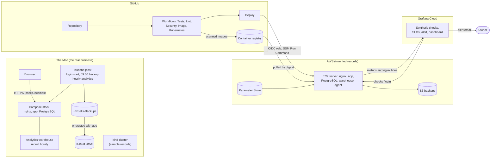

# PSells

The inventory and profit system I run my reselling business on, used from a
browser or from the terminal, and built one layer at a time as a DevOps,
cloud and SRE portfolio: from a Python program that replaced a spreadsheet to
containers, HTTPS, CI that ships to AWS, monitoring against service level
objectives, Kubernetes, and an analytics warehouse.

The real business runs on a Mac. A copy holding invented records only runs on
AWS at `https://psells.lakeshorefreight.me`.

## What it covers

- **The business.** Products held, sales, stock returned to the supplying
  partner and payouts to that partner, each item's partner cut from a rule
  of its own, and a live dashboard of stock, revenue, profit and the balance
  owed. The web pages, the terminal application and the HTTP API call the
  same functions, so they always agree. A sale keeps its own figures, and a
  correction keeps the record as it was in a log that only grows.
- **Running it on the Mac.** nginx, the application and PostgreSQL in
  containers under Compose, served over HTTPS from a certificate authority of
  its own, behind a login. It starts at login, backs itself up every morning
  and proves each backup restores, keeps an encrypted copy off the Mac, and
  shows a notification when a job fails or a certificate nears its end.
- **CI and delivery.** Five workflows on every push: the tests against a real
  PostgreSQL, lint for the shell scripts, nginx and Terraform, a dependency
  audit and a secret scan of the whole history, the images built for two
  architectures and scanned, and the Kubernetes manifests deployed to a
  throwaway cluster. A push to `main` that passes them ships to AWS, with no
  stored keys.
- **The cloud.** The AWS server is described in Terraform and rebuilt from
  it, with a managed database and a load balancer behind a switch.
- **Reliability.** The demonstration is monitored from outside and inside
  against two service level objectives, with one alert and a dashboard, all
  in code, and a deliberate outage was written up as a
  [postmortem](postmortems/2026-10-05-demo-database-stopped.md).
- **Kubernetes.** The same images run on a local cluster from the manifests
  in `k8s/`.
- **Analytics.** An ETL builds a star-schema warehouse from the records, checked
  against the dashboard before it commits; SQL views answer the business
  questions, on a page with charts drawn on the server, refreshed hourly.

## How it fits together

The real business on the Mac, the pipeline on GitHub, and the demonstration
on AWS watched from Grafana Cloud. [ARCHITECTURE.md](ARCHITECTURE.md) has this
and seven more diagrams, each part in detail.

## Where to read next

- [ARCHITECTURE.md](ARCHITECTURE.md): how the whole system fits together, with
  diagrams.
- [RUNBOOK.md](RUNBOOK.md): what to do, from everyday tasks to incidents and
  rebuilding from nothing.
- [DECISIONS.md](DECISIONS.md): why each part is the way it is, indexed by
  area.
- [DATA_MODEL.md](DATA_MODEL.md): what the data means.
- The rest of this file: running it, each part in turn, the tests, and the
  known limitations.

Every figure that can be derived is computed on demand rather than stored, so no
total can drift out of sync with the records it came from. See
[DATA_MODEL.md](DATA_MODEL.md) for the structure and [DECISIONS.md](DECISIONS.md)
for why it is built this way.

## Requirements

Docker, with Compose. PSells runs as three containers: nginx, which is the only
one reachable from outside the stack and passes every request on; the
application behind it, which serves the web pages and the HTTP API and also
holds the terminal application; and a PostgreSQL 18 database beside that.
Everything the application needs is installed inside its image.

Working on it also needs Python 3 on the machine, for the tests:

    pip install -r requirements-dev.txt

`requirements.txt` lists what the application needs to run: FastAPI, uvicorn,
Jinja2 for the templates, python-multipart to read form posts, psycopg, the
PostgreSQL driver, and argon2-cffi, which hashes the login password. `requirements-dev.txt` adds pytest, httpx2 for the test
client, PyYAML so a test can read `compose.yaml`, and openpyxl for
`import_excel.py`, the one-time script that read the original spreadsheet.
It also includes `requirements-analytics.txt`, the analytics image's own:
pandas, numpy and the same psycopg, so the tests can import the ETL.

## Running it

Settings, including the database password, live in `.env` beside
`compose.yaml`. It is gitignored and kept out of every image. Start from the
template, set a real password, and point `PSELLS_CONFIG_FILE` at the
configuration file holding the default partner percentage:

    cp .env.example .env
    openssl rand -hex 24      # paste the result as POSTGRES_PASSWORD in .env

The first time, make the HTTPS certificate and trust its CA, as described under
"The certificate" below:

    ./make-certificate.sh

Then:

    docker compose up --build -d --wait

The first start creates the database and builds its tables from `schema.sql`.
Then create the account, once. It asks for a username and for the password
twice, without showing it; the password must be at least fifteen characters:

    docker compose exec app python set_password.py

Open `https://psells.localhost/` and log in. The same command changes the
password later, and logs out every browser that was logged in. No web page can
change it. The terminal application runs inside the same container, against
the same database, and needs no login, because reaching it already takes
access to the containers:

    docker compose exec app python psells.py

    0: Quit
    1: View Dashboard
    2: View Inventory (in stock)
    3: List Categories
    4: Search (in stock)
    5: Add
    6: Edit
    7: Delete
    8: Record Sale
    9: Record Return
    10: Record Payment
    11: View Out of Stock
    12: Sales History
    13: Returns History
    14: Payments History
    15: Fix Sale
    16: Fix Return
    17: Fix Payment

View Inventory and Search cover the products with at least one unit
available, as the inventory page does; View Out of Stock lists the rest, each
with the reason. Edit and Delete still choose from every product. Fix Sale,
Fix Return and Fix Payment list their records with ids, then edit one, Enter
keeping each current value, or delete it after saying what that changes.

Search matches a product name or a category, so typing a category returns
everything in it. Choosing a product to sell, edit or delete matches on the name
only, deliberately, so that an action is never offered against a whole category
at once.

`docker compose down` stops both containers and keeps the data.
`docker compose down -v` deletes it.

The application reads two settings from its environment, and Compose sets both:

    PSELLS_DATABASE_URL   the PostgreSQL database, with no default
    PSELLS_CONFIG         the JSON configuration file, mounted read-only

Without a database address, or with one that does not answer, the application
stops with a sentence saying so rather than a stack trace.

## Trying it with sample data

The real data is not in this repository. Everything under `data/` is gitignored,
because this tracks a real business and its prices, margins and commercial terms
do not belong in a public repository.

To see the application working, run a second copy of the stack under its own
project name, `psells-sample`, so it gets a database volume of its own and can
never touch the real one, load the invented records into it, and give it the
sample configuration. From the project folder, with `.env` in place:

    PSELLS_NETWORK=10.213.48 PSELLS_CONFIG_FILE=./sample_data/config.json docker compose -p psells-sample up --build -d --wait
    docker compose -p psells-sample exec -T db sh -c 'psql -q -v ON_ERROR_STOP=1 -U "$POSTGRES_USER" "$POSTGRES_DB"' < sample_data/seed.sql

Then create an account in it with
`docker compose -p psells-sample exec app python set_password.py`, open
`https://psells.localhost/` and log in, or run the terminal application with
`docker compose -p psells-sample exec app python psells.py`. When finished,
remove it and its database:

    docker compose -p psells-sample down -v

`PSELLS_CONFIG_FILE` is set on the command itself rather than in `.env`, so the
real stack goes on reading the real configuration. The percentage in
`sample_data/config.json` is a placeholder, not the real figure.
`PSELLS_NETWORK` gives the sample stack its own address range, because two
stacks cannot share one and the real stack keeps its network while it is
stopped. Only one of the two stacks can hold ports 443 and 80 at a time. Both
use the same certificate from `data/tls/`.

The sample set is an invented business of about 80 products in nine
categories, with a year of sales to September 2026, a dozen returns and
monthly payments to the partner, and it covers the cases worth seeing: all
three partner-share modes, a product discontinued at retail, products out of
stock for each reason, and a balance still owed. It is written by
`sample_data/generate_seed.py`, from a fixed random seed, so it is the same
on every run; the script checks each invented product with the application's
own rules and works out each sale's partner cut with its own function, and a
test fails if `seed.sql` is ever edited by hand. Change the script and run it
again: `venv/bin/python sample_data/generate_seed.py`.

## The web interface

Served at `https://psells.localhost/`, through nginx, by the `app` container
behind it. One process serves the pages and the API.

- **Inventory**, the home page: the nine dashboard figures, which cover every
  product, above a table of the products with at least one unit available, with
  stock, listed price, partner cut and retail price (or Discontinued), and a
  search box that matches name or category among them.
- **Out of stock**: the products with none available, each with the reason,
  "Sold out", "Returned" or a mix such as "2 sold, 1 returned of 3", and a
  search of their own. Every product is on exactly one of the two pages. After
  a sale, return or edit that leaves a product with none, the inventory says so
  and links here.
- **Sales**, **Returns** and **Payments**: every record of each kind, newest
  first. A sale's row shows the price each, the sale total, the partner cut for
  the sale and the profit, all from the figures frozen when it sold, so editing
  a product never changes a past sale. Each page says so in a sentence when
  there is nothing to list.
- **Edit** and **Delete** on each of those rows, to correct a record entered
  wrongly. A sale keeps its product and frozen partner cut; a return keeps its
  product. A quantity can rise only as far as the stock allows. Delete has a
  confirmation page saying what it changes. Every correction is written,
  with the record as it was, to the `corrections` log.
- **Add** and **Edit** a product. The edit form opens filled in; a field emptied
  there is cleared, unlike the command line, where Enter keeps the current value.
- **Sell**, **Return** and **Edit** from each row with stock, **Edit** from each
  out-of-stock row, **Record payment** from the navigation, and **Delete** from a
  product's edit page.
- **Analytics**: the analysis, from the analytics warehouse described under
  "Analytics" below: headline figures, revenue and profit by month as bars
  with cumulative revenue as a line, revenue by category with each one's
  margin, sell-through and share, the ten most profitable products and the
  ten with the lowest sell-through. The charts are SVG drawn on the server,
  since no page runs scripts, and each bar's exact figure is its tooltip.
  Where no warehouse is set up, as on the demonstration for now, the page
  says so.

The pages are a view, not a second implementation, and three rules keep them
one. A page route calls the same `psells` functions the command line calls and
does no arithmetic on money, stock or partner share; the analytics page reads
the warehouse's views instead, and `charts.py` works out where to draw them.
Wherever a page shows a figure the API also serves, a test asserts the two
agree. And templates format and never compute, which a test enforces by
parsing every template and failing on any arithmetic or any filter other than
the two that format: `money` for cents and `percent` for a view's ratios.

Every form answers a successful save with a 303 redirect, so refreshing the page
afterwards cannot repeat it. A refusal shows the form again with a sentence
beside each field that is wrong and everything already typed kept: 422 when what
was typed is wrong in itself, 409 when it was fine and the stock disagrees.

### Logging in

Every page asks for a login first, except the login page itself. A wrong
password and an unknown username get the same sentence. A login lasts until two
hours pass without a request, or twelve hours after it began, whichever comes
first; **Log out**, in the header of every page, ends it at once. The password
is stored only as an Argon2id hash, and the session only as a hash of the
value in the browser's cookie, so neither the database nor a backup holds
anything that would log someone in. The cookie is `__Host-psells_session`:
sent over HTTPS only, unreadable by scripts, and not sent with another site's
form posts. nginx allows five login attempts a minute from one address, with a
burst of five, and answers 429 past that.

Every write is checked twice, independently. Every form carries a hidden token
belonging to the login session, and a write without it is refused with a 403.
And any write that a browser labels as coming from another site is refused with
a 403 before any route runs, including one sent from another server on the same
machine; that check is what covers the login form, which has no session yet.
See [DECISIONS.md](DECISIONS.md) for the reasoning behind each.

## The HTTP API

`api.py` serves the same data over HTTP. It is another way in, not another
application: every figure it returns comes from the functions the command line
uses, and it works nothing out for itself. It is served by the same uvicorn
process as the pages. `https://psells.localhost/openapi.json` describes every
endpoint with its fields and types, generated from the code. FastAPI's
interactive pages for it, `/docs` and `/redoc`, are turned off: they load their
JavaScript from a CDN pinned only to a major version, and would run it on the
same site as the forms.

    GET  /products                every product, with stock and the partner cut per unit
    GET  /products/in-stock       the products with at least one unit available
    GET  /products/out-of-stock   the rest, each with its reason
    GET  /dashboard               the nine dashboard figures
    GET  /sales                   every sale, newest first, with its total, partner cut and profit
    POST /sales                   record one sale
    PUT    /sales/{id}            correct a sale: quantity, sale_price_cents, date
    DELETE /sales/{id}            delete a sale
    GET  /returns                 every return, newest first
    PUT    /returns/{id}          correct a return: quantity, date, notes
    DELETE /returns/{id}          delete a return
    GET  /payments                every payment, newest first
    PUT    /payments/{id}         correct a payment: amount_cents, date, notes
    DELETE /payments/{id}         delete a payment
    GET  /session                 the form token of the session asking

The lists are the ones the pages and the terminal show, from the same
functions, and tests compare all three.

All money is sent and received as a whole number of cents, never as dollars and
never as a formatted string. That matches how it is stored, keeps every value
exact, and leaves formatting to whatever is showing it to a person.

The API takes the same login as the pages: the session cookie from logging in
at `/login`. Without it, every endpoint, `/openapi.json` included, answers 401
with `{"detail": "Log in first."}`. A write also needs the session's form token
in an `X-Form-Token` header, which `GET /session` returns. With curl:

    curl --cacert ~/PSells-CA/ca.crt -c jar -d username=... -d password=... https://psells.localhost/login
    TOKEN=$(curl -s --cacert ~/PSells-CA/ca.crt -b jar https://psells.localhost/session | python3 -c 'import json,sys; print(json.load(sys.stdin)["form_token"])')
    curl --cacert ~/PSells-CA/ca.crt -b jar -H "X-Form-Token: $TOKEN" -H 'Content-Type: application/json' \
        -d '{"item_id": 1, "quantity": 1, "sale_price_cents": 9000}' https://psells.localhost/sales

To try it against invented records rather than the real ones, use the sample
stack above.

## Changing the schema of an existing database

`schema.sql` builds the tables only when the database is first created, so a
table added to it later never reaches a database that already exists. Each
such change is also written as a file in `migrations/`, applied once, by hand,
after a backup:

    ./backup.sh
    docker compose exec -T db sh -c \
        'psql -v ON_ERROR_STOP=1 --single-transaction -U "$POSTGRES_USER" -d "$POSTGRES_DB"' \
        < migrations/0001_authentication.sql

`--single-transaction` makes it all or nothing and `ON_ERROR_STOP` stops it at
the first error, so running one twice stops at "already exists" and changes
nothing. They are applied in order, each once:

- `0001_authentication.sql` adds the `users` and `sessions` tables.
- `0002_corrections.sql` adds the `corrections` log.

Each touches nothing else, and a database created from the current
`schema.sql` already has every table they add. `tests/test_schema.py` builds a
database both ways and fails if the two differ.

## Moving from SQLite

`migrate_to_postgres.py` moved the records out of the SQLite file PSells used
before PostgreSQL, once, in Phase 04. It reads a copy of that file read-only,
refuses a database that already holds records, and refuses a source that fails
SQLite's own integrity or foreign key checks. It copies every row with its id,
moves each table's sequence past the highest one, and then checks the result
against the source before committing anything: every row and column, every
product's derived stock and partner cut, and all nine dashboard figures, each
worked out by the same functions on both sides. Money is whole cents on both,
so the comparison is exact. Any difference rolls everything back.

It runs in a one-off container of the app service, because the database
publishes no port, with the script and the copy mounted read-only:

    docker compose run --build --rm \
        -v "$PWD/migrate_to_postgres.py:/app/migrate_to_postgres.py:ro" \
        -v "/path/to/copy-of-psells.db:/migrate/psells.db:ro" \
        app python migrate_to_postgres.py /migrate/psells.db

It prints row counts and a verdict, never a figure. `tests/test_migrate.py`
runs it against a SQLite file built from the old schema, kept in
`tests/sqlite_schema.sql` for that purpose only.

## How the containers are built

The `Dockerfile` builds an image holding the code and nothing else. The records
live in the database container, and the configuration file is mounted into the
application at `/config/config.json`, read-only, so an image never carries a
record. It names every file it copies rather than copying the folder, and
`.dockerignore` keeps `data/` and `.env` out of the build altogether.

nginx is the only service that publishes ports: 443 for HTTPS and 80, which
only redirects to it, both on `127.0.0.1`, forwarded to 8443 and 8080 inside
its container. Publishing them on `127.0.0.1` is what keeps them to this
machine. Leaving out the `127.0.0.1:` publishes them to the whole network, so
anyone on the same Wi-Fi could reach the login page and start guessing.
nginx runs PSells' own image, built from `nginx/Dockerfile`: the Docker
Official Image, in its slim variant with none of the add-on modules, pinned by
digest, with Alpine's security fixes for zlib, pcre2 and OpenSSL installed on
top, because in October 2026 nginx's images lagged behind Alpine's fixes. It
runs as its own unprivileged user, never root,
with its whole configuration in `nginx/nginx.conf`, mounted read-only, and the
certificate and key mounted read-only from `data/tls/`.

What differs from one place PSells runs to another is not in `nginx.conf`: the
name it answers to, its certificate, and what plain HTTP does live in a folder
per place under `nginx/sites/`, `localhost` on the Mac and `aws` on the server,
and `nginx.conf` includes the two files of whichever folder is mounted, and any
servers the folder adds of its own. The four security headers and the way a
request reaches the application (the login limit and the forwarded headers)
are in `nginx/snippets/`, included by every server that serves PSells, so each
is written once and is the same everywhere.

HTTPS ends at nginx, TLS 1.3 only. It answers for `psells.localhost` and no
other name: an HTTPS handshake for another name is refused, a request that
names another host only in its `Host` header gets 421, and plain HTTP for any
name is redirected to `https://psells.localhost` with the path kept. That is
what stops DNS rebinding, where a hostile site points its own name at
`127.0.0.1` so the browser reads these pages as if they were that site's. It
passes every request to the application over the private network Compose
creates, as plain HTTP, with the `Host` the browser sent and with
`X-Forwarded-Proto` and `X-Forwarded-For` set to what nginx itself saw, so a
client cannot supply its own.

Every response from PSells carries four headers set by nginx:
`Strict-Transport-Security` for a year, so a browser that has visited once
never tries plain HTTP for `psells.localhost` again; a `Content-Security-Policy`
that allows no scripts at all, only the one style block in `templates/base.html`
by the hash of its text, forms that post only to PSells, and no framing by
another site; `X-Content-Type-Options: nosniff`; and `Referrer-Policy:
same-origin`. nginx does not name its version, and refuses a request body over
64 KB with a 413. Changing the style block in `base.html` changes its hash, and
a test then fails with the new hash to put in `nginx/nginx.conf`.

`nginx/nginx.conf` is read from this folder, not from an image, so the running
nginx takes a change to it the next time it starts or reloads, whatever version
of the application is running. A change to the style block therefore reaches
the stack as one release: rebuild the application with it
(`docker compose up --build -d --wait`), rather than restarting nginx alone. A
change to `nginx.conf` only is applied with:

    docker compose exec proxy nginx -t && docker compose exec proxy nginx -s reload

`curl` does not use the macOS keychain, so it is told about the CA directly:

    curl --cacert ~/PSells-CA/ca.crt https://psells.localhost/

The application publishes no port. Inside its container uvicorn listens on
`0.0.0.0`, because traffic from another container arrives on the container's
network interface, not its loopback. It believes `X-Forwarded-Proto` and
`X-Forwarded-For` from nginx's address only, set as `FORWARDED_ALLOW_IPS`. That
is why the stack's network has a fixed range, `10.213.47.0/24`, with nginx at a
fixed address outside the part Docker hands out. If the range ever clashes
with a network the Mac is on, `PSELLS_NETWORK` in `.env` moves it.

The three services restart whenever Docker starts (`restart: unless-stopped`),
so PSells comes back after Docker Desktop restarts or the server reboots; a
container stopped on purpose with `docker compose stop` stays stopped.

`--wait` returns once every service reports healthy: the database when it
accepts connections, the web server when uvicorn does, and nginx when it
answers its own health check. Without it, a request
made straight after `up` can get an empty reply, because Docker accepts a
connection on the published port before the server inside is listening.

The database publishes no port at all: only the application reaches it, over
the private network Compose creates, and
`docker compose exec db psql -U psells psells` is the way to a SQL prompt. Its
files live in a Docker volume named `psells_pgdata`, not in this folder. The
application's address for it is assembled in `compose.yaml` from the same
values in `.env` the database is created with, so the password is written once.
`tests/test_container.py` holds all of this in place.

## The certificate

PSells is served over HTTPS at `https://psells.localhost`, with a
certificate from a certificate authority of its own rather than a public one,
because a public one needs a public name. `make-certificate.sh` makes both:

    ./make-certificate.sh

The first run creates the CA in `~/PSells-CA`, outside the project, readable by
you only. Its certificate can sign for `psells.localhost` and nothing else:
its name constraint permits that one name and excludes every IP address, so
its key could not be used to impersonate any other site even if it leaked. It
lasts five years. The script then prints the command that tells macOS to trust
it, once, for your user:

    security add-trusted-cert -r trustRoot -k ~/Library/Keychains/login.keychain-db ~/PSells-CA/ca.crt

Safari and Chrome use that trust; Firefox keeps its own list.

Every run signs a new certificate for `psells.localhost` with that CA, into
`data/tls/`, which git and the Docker build both ignore. It lasts 397 days,
inside the limit browsers apply to public certificates, so renewing is
running the script again, with nothing to change in the keychain. nginx reads
both files when it starts, so after renewing:

    docker compose restart proxy

The script refuses to sign a certificate that would outlive its CA, and
replaces the old certificate only once the new one verifies.

Nothing needs remembering: each morning's backup runs `check-certificates.sh`,
which shows a notification when the certificate, the cluster's, or the CA is
within 30 days of its end, naming the command that renews it. The CA is
warned about 30 days before it has 397 days left, since from then on the
script would refuse to renew the certificate. RUNBOOK.md has the steps.

`.localhost` names always mean this machine, and Safari, Chrome and curl find
`psells.localhost` without any change to `/etc/hosts`.

The AWS server has a certificate from Let's Encrypt instead, which every
browser trusts; see "The demonstration on AWS" below.

## Backups

`backup.sh` takes a `pg_dump` of the database in the Compose stack into
`~/PSells-Backups/daily/`, logs the result to `~/PSells-Backups/backup.log`, and
removes copies older than thirty days. It carries `data/config.json` along,
because the partner rate is in no repository and the application will not
start without it.

Every dump is proved before anything old is deleted: it is restored into a
throwaway database on the same server, its products are counted and compared
with the live database, and the throwaway is dropped. A dump that does not
restore, or restores empty, or disagrees, is logged as `FAILED` with the
reason, and nothing is removed. A backup that is valid and empty is worse than
no backup, because it looks fine in a listing.

If the database container is not running, the script starts it, and only it;
if Docker Desktop is not running, it waits two minutes and then logs that it
could not reach the database.

Run it by hand:

    ./backup.sh
    tail -1 ~/PSells-Backups/backup.log

Or daily at 09:00 through launchd, macOS's own scheduler. The job file is
`launchd/local.psells.backup.plist`, a template with its paths filled in on
install. From the project folder:

    sed -e "s|__PROJECT_DIR__|$PWD|" -e "s|__HOME__|$HOME|" \
        launchd/local.psells.backup.plist > ~/Library/LaunchAgents/local.psells.backup.plist
    launchctl bootstrap gui/$(id -u) ~/Library/LaunchAgents/local.psells.backup.plist

launchd rather than cron because a Mac asleep at 09:00 runs the backup when it
wakes; cron skips the day. A Mac that is shut down still misses it.

## Starting the stack at login

On the Mac, Docker's restart policy is not enough. On 7 October 2026 the Mac
booted, Docker Desktop started and quit within seconds, and when it came back
it restarted none of the three containers; only the 09:00 backup, which starts
the database itself, brought anything back. So a second launchd job,
`launchd/local.psells.start.plist`, runs `start-stack.sh` at every login. It
waits up to twenty minutes for Docker Desktop, then runs
`docker compose up -d --wait --no-recreate`: it starts whatever is not running
and leaves every running container exactly as it is, building nothing and
applying no changed configuration. It refuses to run anywhere but the folder
holding `data/config.json`, and logs to `~/Library/Logs/psells-start.log`.
Install it as the backup job is, from the project folder:

    sed -e "s|__PROJECT_DIR__|$PWD|" -e "s|__HOME__|$HOME|" \
        launchd/local.psells.start.plist > ~/Library/LaunchAgents/local.psells.start.plist
    launchctl bootstrap gui/$(id -u) ~/Library/LaunchAgents/local.psells.start.plist

It runs once as soon as it is installed, which on a running stack changes
nothing.

To restore a dump, follow RUNBOOK.md's "Restore a backup": the database is
emptied first, because a new stack's database already holds the tables
`schema.sql` built and a restore on top of them fails, and the dump goes in
without its grants, in one transaction, after which the ETL's role is made
again. The command given here until 9 October 2026 failed on a new stack for
both reasons.

Each morning's backup also leaves the Mac, encrypted. `offsite-backup.sh`
packs the dump and the configuration into one archive, encrypts it with
[age](https://age-encryption.org) to the public key in
`data/backup-recipient.txt`, writes it into iCloud Drive's `PSells-Backups`
folder, keeps 30 days there too, and proves each copy the morning it is made
by decrypting it with the private key in the Mac's Keychain and comparing it
with the original. iCloud only ever holds ciphertext. The private key is kept
twice, in the Keychain and in a password manager, so a lost Mac loses
nothing; restoring from that copy is in RUNBOOK.md. This is the one way the
real records leave the Mac, and they leave encrypted. The demonstration
server's backups go to S3, described below, and hold invented records only.

The Mac is not monitored, so its three background jobs say when they fail:
`backup.sh`, `start-stack.sh` and `refresh-analytics.sh` each show a macOS
notification, with a sound, through `notify.sh`, giving the job's reason and
never a figure. The hourly refresh shows one only on its first failure after
a run that worked, so a night with Docker stopped is one notification, not
eight.

## The demonstration on AWS

A copy of PSells runs at `https://psells.lakeshorefreight.me`, on one small
EC2 server in AWS's Montreal region, holding the invented records from
`sample_data/seed.sql` and the placeholder partner percentage, never the real
ones. It exists to show the system running in the cloud, and it costs nothing:
the account is on AWS's free plan, which cannot be charged, and the server
lives inside that plan's six months.

It is the same stack, with `compose.aws.yaml` laid over `compose.yaml`. That
file holds everything that differs on the server: the application's image,
published by CI and pulled by digest rather than built there, ports 443 and 80
published on every address rather than `127.0.0.1`, the `aws` site folder for
nginx, a Let's Encrypt certificate in place of the Mac's own CA, the folder
Let's Encrypt's challenge is answered from, and a `certbot` service run only
when asked for. The Mac never reads it.

How it is put together:

- **No SSH.** The server's firewall lets in ports 80 and 443 and nothing else.
  A shell on it comes through AWS Systems Manager Session Manager, signed in
  with the same short-lived credentials as the AWS CLI, and nobody holds an
  SSH key.
- **No long-lived keys.** The CLI signs in with `aws login`, which gives
  credentials that last hours, not an access key. The server itself acts
  through its IAM role, which may read the database parameters and the backup
  bucket's name, add backups to that bucket, and do nothing else: it cannot
  read, list or delete what is already there.
- **Secrets in Parameter Store.** The database password is a `SecureString`
  under `/psells/postgres`, generated there and never written in the
  repository. `deploy/aws/deploy.sh` writes `.env` from it on each deploy,
  readable by root only.
- **The certificate.** certbot, pinned like every other image, gets it and
  renews it through the webroot nginx serves on port 80, twice a day from a
  systemd timer, and nginx reloads afterwards. certbot runs as nginx's own
  user, so the private key is readable by its owner only and its owner is the
  one process that reads it.
- **Backups.** Once a day `deploy/aws/backup-to-s3.sh` dumps the database,
  proves the dump restores, as `backup.sh` does, and only then copies it to a
  private, encrypted S3 bucket that deletes each copy after thirty days.
- **The sample records.** A deploy loads `sample_data/seed.sql` only into a
  database with no products, so a new server starts with them and a running one
  keeps whatever it holds. A change to the seed reaches the demo at the next
  nightly reset, or once the server is rebuilt.
- **A public login, reset every night.** The demo's username and password are
  published, so anyone can try it, and may add, edit and delete the invented
  records. At 07:00 UTC `deploy/aws/reset-demo.sh` (`psells-reset.timer`)
  empties the records and the corrections log and loads the seed again, in
  one transaction that keeps the login, then rebuilds the warehouse. Nobody
  can change the password from the web; only `set_password.py` on the server
  can. It refuses to run beside `data/config.json`, so never on the Mac.

### Shipping from a push

A push to `main` goes live by itself, in about five minutes, once every check
has passed:

1. **Image** builds the application's image on amd64 and on arm64, the
   server's architecture, scans each, and publishes the scanned images to
   GitHub's container registry as `ghcr.io/pierremakhlouta/psells:<commit>`.
   The scanner runs in a job that can publish nothing; a separate job, which
   runs no third-party code, pushes each image only if its ID is the one that
   was scanned.
2. **Deploy** starts whenever Tests, Lint, Security, Image or Kubernetes
   finishes on `main`, and its gate goes on only when all five have passed for
   that exact commit. A failed check means no deploy; a scheduled scan deploys nothing.
3. It signs in to AWS with GitHub's OpenID Connect token, which AWS trades for
   a role trusted only by `main` of this repository, for fifteen minutes. No
   AWS key is stored in GitHub.
4. That role can run one thing: the SSM document `psells-deploy`, on the
   server tagged `psells`. The document accepts a full commit hash and an image
   digest, each checked by AWS against a pattern before anything runs, checks
   out the commit and runs `deploy/aws/deploy.sh`, which pulls the image by
   digest and refuses one that is not that commit's own.
5. The workflow fails unless the server reports running exactly that digest
   and the site answers over trusted HTTPS.

Rolling back is the same workflow run by hand with an earlier commit on
`main`, which redeploys that commit's own scanned image, in under a minute:

    gh workflow run deploy.yml -f commit=<full hash of an earlier commit>

It refuses a commit whose checks did not all pass. By hand on the server, as
root through Session Manager, a deploy is:

    git -C /opt/psells fetch --quiet origin
    git -C /opt/psells checkout --quiet --detach <commit>
    PSELLS_IMAGE_DIGEST=<its digest> /opt/psells/deploy/aws/deploy.sh

`deploy.sh` and `backup-to-s3.sh` refuse to run where `data/config.json`
exists, which is only ever the Mac, so neither can overwrite the real `.env` or
send the real records anywhere.

### The server as code

Everything the demonstration uses in AWS is described in Terraform in
`infra/aws/`: the server and its fixed address, the firewall, the server's
role and its two policies, the backup bucket and its settings, the plain
parameters, the account's default of encrypted disks, and the budget. Only
the IAM user Terraform runs as, its group and the root user are left out, so
a mistake in a plan can never remove the access that runs it, and the
database password, because Terraform keeps a copy of every value it manages
in its state, in plain text.

The state lives in an S3 bucket of its own, private, encrypted, versioned and
locked while a plan runs. That bucket is made once by `infra/aws/bootstrap/`,
a small configuration whose own state stays on the machine that ran it. From
`infra/aws/`, signed in with `aws login`:

    AWS_PROFILE=psells terraform init
    AWS_PROFILE=psells terraform plan

A plan that reports no changes is the proof that the code describes what is
running. The address the budget's alerts go to is read from
`infra/aws/terraform.tfvars`, which git ignores:

    alert_email = "you@example.com"

A new server sets itself up. Terraform gives it `deploy/aws/first-boot.sh`,
which prepares the host, clones this repository and runs `deploy.sh`, which
now also fetches a certificate from Let's Encrypt when the server has none.
Rebuilding the server from code is therefore one command, and the address,
the name and the certificate's name survive it:

    AWS_PROFILE=psells terraform apply -replace=aws_instance.server

It takes about ten minutes, most of it installing Docker and pulling images;
the application's image is the one CI published for the head of `main`. A rebuilt server starts with the sample records and no
account, so the demonstration's password is set again through Session
Manager. `-var acme_staging=true` asks Let's Encrypt's staging service
instead, whose certificates no browser trusts and which has no weekly limit,
for trying a rebuild.

`terraform destroy` is the cost control: it removes everything above. It
stops at the backup bucket while the bucket holds backups, rather than
deleting them, and it leaves the state bucket and the database password,
which it does not manage.

The Lint workflow checks the formatting of every configuration and validates
each one against the provider the lock file pins, without reaching AWS. The
deploy role and the `psells-deploy` document are in `infra/aws/deploy.tf`.

### A managed database and a load balancer, on a switch

`infra/aws/database.tf` and `loadbalancer.tf` describe a managed PostgreSQL on
RDS and an Application Load Balancer in front of the server. Together they
cost about USD 50 a month, which would end AWS's free plan months early, so
they exist only while the variable `managed_services` is on. It is off: the
demo runs on its own database container, behind nginx alone, and the plan
reports no changes. They were switched on, proved and switched off again, and
can be switched on to show them.

While on:

- **RDS** is PostgreSQL 18.6, the version the containers run, private (it has
  no public address, and its security group admits the server alone),
  encrypted, and holding the demo's records. Its password is the existing
  Parameter Store secret, read by Terraform only for the moment and sent
  write-only, so it is never stored in the state. Terraform writes its address
  to `/psells/postgres/host`, and the next deploy points the app at it over TLS
  with RDS's certificate verified against AWS's authorities, builds its tables
  from `schema.sql` and loads the sample records. The daily backup dumps it
  and proves the dump in the database container.
- **The load balancer** answers `https://lb.psells.lakeshorefreight.me` with a
  free certificate from AWS, TLS 1.3 only, and forwards to a listener of
  nginx's own on port 8090, which the server's security group opens to the load
  balancer alone. That listener believes the visitor's address the load
  balancer adds, and only from the VPC's private range, so the login limit
  still counts visitors; a request for any other name is refused at the load
  balancer.

On, in this order:

    AWS_PROFILE=psells terraform apply -var managed_services=true
    gh workflow run deploy.yml -f commit=<head of main>

then a CNAME at the registrar from `lb.psells` to the `lb_address` output,
and the demo's password set again, since RDS starts empty. Off, so the app
leaves RDS before RDS goes:

    AWS_PROFILE=psells terraform destroy -var managed_services=true -target='aws_ssm_parameter.postgres_host[0]'
    gh workflow run deploy.yml -f commit=<head of main>
    AWS_PROFILE=psells terraform apply

and the CNAME removed. The certificate and the record that proves the name to
AWS stay; both are free.

## Monitoring the demonstration

The AWS demo is watched by a Grafana Cloud stack on its free tier, which
costs nothing and needs no card. Only the demo: the real business's records
and activity never leave the Mac, so nothing on the Mac is sent anywhere.

- **From outside.** Grafana checks `https://psells.lakeshorefreight.me/login`
  from Montreal, North Virginia and London every two minutes, over HTTPS with
  the certificate checked, passing only on a 200. Three places, so one
  location's own network is never mistaken for the site's; every two minutes,
  so the checks use 64,800 of the free tier's 100,000 runs a month.
- **From inside.** An agent, Grafana Alloy, runs beside the stack on the
  server only (`compose.aws.yaml`, configured by `monitoring/config.alloy`).
  It sends the server's CPU, memory, disk, load and network, and nginx's
  access log, read from the system journal. It has no Docker socket, runs as
  its own user with no capabilities and a 160 MB ceiling, publishes no port,
  and keeps only nginx's JSON lines, which carry no visitor address, no query
  string and no browser string. From those lines it counts requests by status
  class and records how long each took.
- **Two service level objectives**, over a rolling seven days: 99.5% of the
  outside checks pass, and 99% of requests are answered in under 500 ms.
- **One alert**: the site is down, meaning under half of the checks passed
  over five minutes, held for two. It is emailed, and so is its resolution.
  No data alerts too.
- **A dashboard**, `monitoring/dashboards/psells-demo.json`: the SLOs, requests
  by status and time to answer, the checks by location, the server, and
  nginx's lines.

Everything on Grafana's side is Terraform in `infra/grafana/`, with its state
beside `infra/aws/`'s. Its two tokens are read from the Mac's Keychain for the
length of the command, and the stack's name and the alert address are in
`terraform.tfvars`, which git ignores:

    export AWS_PROFILE=psells
    GRAFANA_AUTH=$(security find-generic-password -s psells-grafana-terraform -w) \
    GRAFANA_SM_ACCESS_TOKEN=$(security find-generic-password -s psells-grafana-sm -w) \
    terraform plan

The agent's addresses and its write-only token are in Parameter Store under
`/psells/grafana`, written into `.env` on each deploy.

The monitoring was tested by stopping the demo's database for fifteen
minutes. The alert fired after 5 minutes 17 seconds; the write-up, with what
it found and what was fixed, is
[postmortems/2026-10-05-demo-database-stopped.md](postmortems/2026-10-05-demo-database-stopped.md).

## Kubernetes on the Mac

PSells also runs on a local Kubernetes cluster, made by kind (Kubernetes in
Docker), from the manifests in `k8s/`. It holds the invented sample records
only: the real ones stay in the Compose stack, which the cluster never
touches. It answers at `https://psells.localhost:9443`, on `127.0.0.1` only,
beside the real stack on 443.

What runs in it:

- **The database**, a StatefulSet of one with its own volume, the same pinned
  PostgreSQL image as `compose.yaml`, built on its first start from
  `schema.sql` and `sample_data/seed.sql`, read where they are. Its password is
  made at random by `k8s/up.sh` the first time, handed to kubectl on its
  standard input, and kept in a Secret; it is printed and written nowhere.
- **PSells**, one pod holding the app and nginx: the images CI scanned and
  published for one commit, pinned by digest. The two containers share the
  pod's network, so uvicorn listens on `127.0.0.1` only and no other pod can
  reach it without nginx, and it believes forwarded headers from `127.0.0.1`
  alone. nginx runs the repository's own `nginx.conf`, snippets and the Mac's
  site, from ConfigMaps kustomize makes from those files, so a change to any of
  them rolls the pod. Both containers run as their image's own user, with a
  read-only filesystem and every Linux capability dropped.
- **A NodePort Service** on 30443, which `k8s/kind.yaml` maps to
  `127.0.0.1:9443`. HTTPS only.

The certificate is the cluster's own, signed by the Mac's CA, so the browser
trusts it, but with its own key, so the cluster never holds the real stack's.
Made once, outside the repository:

    PSELLS_TLS_DIR=~/PSells-Kind/tls ./make-certificate.sh

Then, with kind and kubectl installed:

    k8s/up.sh      # creates or updates the cluster, about 75 s from nothing
    k8s/down.sh    # deletes the cluster named psells, and nothing else

`up.sh` is safe to run again: it keeps the cluster and the database password,
applies the manifests server-side so unchanged objects stay untouched, and
restarts PSells only if the certificate changed, since nginx reads it when it
starts. The cluster's login is set as the stack's is, in the cluster's own
sample database:

    kubectl --context kind-psells -n psells exec -it deploy/psells -c app -- python set_password.py

Logins survive the pod: sessions are rows in PostgreSQL. Deleting the pod
while a browser was logged in left the site unanswered for about three
seconds, and the browser still logged in, with the same figures, on the new
pod. The app's probes ask whether uvicorn answers, not whether the database
does: with the database down the pod stays in the Service and every page
answers 503, rather than the browser getting nothing.

Every push builds the same cluster from nothing in CI, in the Kubernetes
workflow, with a throwaway CA, and asks it what a browser would: the login
page with its certificate checked, the redirect keeping the port, 421 for
another name, 401 for a wrong login, `up.sh` again changing nothing, and both
pods deleted and replaced with the records intact. kind there is its release
binary, run only once it matches the hash written in the workflow. Deploy
waits for it.

## Analytics

The analytics side turns the business records into tables built for analysis,
in a database of its own, the warehouse. It runs on the Mac, against the real
records, and nothing it makes leaves the Mac; tests, CI and anything published
use invented data.

- **The warehouse** is a second PostgreSQL, in `compose.analytics.yaml`, which
  is laid over `compose.yaml` only for analytics: it has its own user,
  password and volume and publishes no port. It holds derived figures only,
  rebuilt in full on every run, so the business database goes on storing
  facts and nothing else.
- **The ETL**, `analytics/etl.py`, runs in an image of its own built from
  `analytics/Dockerfile`, with pandas, so the app's image carries none of it.
  It reads the business database as `psells_etl`, a role that can read the
  four business tables and the products view and nothing else, through
  psells' own functions and inside one read-only snapshot. It reshapes their
  rows and works out no figure of its own. It recreates the warehouse's tables
  and fills them in one transaction, and commits only if the warehouse adds
  up to all nine of the dashboard's figures; otherwise the last warehouse
  stays. It prints counts, never a figure.
- **The tables** form a small star, in whole cents, described in
  `analytics/warehouse.sql`: `dim_product` with each product's stock,
  `dim_date` with every day from the first event to the last, `fact_sales`
  with each sale's total, partner cut and profit, `fact_returns`,
  `fact_payments`, and `etl_run`, which says when it was built. A product
  discontinued at retail has no retail price there, rather than the 0 the
  business database stores, so averages leave it out. Whether a product is
  in stock is psells' own answer. Notes are left out.
- **The views**, in `analytics/views.sql`, answer the business questions once,
  for whatever shows them: `sales_by_month` (every month, gaps as zeros, with
  a running total and the change from the month before), `sales_by_week` (by
  ISO week), `category_performance` (stock, revenue, margin, sell-through and
  share of revenue), `product_performance` (every product, sold or not,
  ranked by units, revenue and profit, overall and within its category) and
  `kpis` (one row of headline figures and when they were built). Margin is
  summed profit over summed revenue; sell-through is units sold over units
  received. Ratios are fractions, unrounded, and empty where there is nothing
  to divide by. The ETL makes the views after each load, in the same
  transaction.

Set up once, from the project folder: add two passwords to `.env`, each made
with `openssl rand -hex 24` (`.env.example` names them), and create the
read-only role in the running stack, which changes no table:

    analytics/create-etl-role.sh

Then build it once, which also builds the analytics image:

    docker compose -f compose.yaml -f compose.analytics.yaml up -d --wait warehouse
    docker compose -f compose.yaml -f compose.analytics.yaml run --rm --build etl

After that it rebuilds itself every hour. `refresh-analytics.sh`, run by a
third launchd job on the hour and once at login, waits for Docker Desktop
and a healthy database without ever starting it, brings up the warehouse and
runs the ETL alone, and appends one line to `~/Library/Logs/psells-etl.log`:
ok with the counts, or FAILED with the reason. It never builds, so a change
to the analytics code reaches it with the `--build` command above. Install
it as the other two are:

    sed -e "s|__PROJECT_DIR__|$PWD|" -e "s|__HOME__|$HOME|" \
        launchd/local.psells.analytics.plist > ~/Library/LaunchAgents/local.psells.analytics.plist
    launchctl bootstrap gui/$(id -u) ~/Library/LaunchAgents/local.psells.analytics.plist

The analytics page warns when the warehouse is more than two hours old, two
missed runs, so a failing refresh is seen where the figures are read.

On the demonstration server the same warehouse runs with its ETL's published
image, each under a hard memory ceiling (128 MiB and 192 MiB, against about
361 MiB the server had free), with settings in `compose.aws-analytics.yaml`,
a file of its own because the backup and the certificate renewal use
`compose.aws.yaml` without the analytics files. The deploy makes both
read-only roles, builds the warehouse once and installs
`psells-analytics.timer`, which runs the ETL every hour; its output is in
`journalctl -u psells-analytics.service`. The passwords are in Parameter
Store beside the database's.

For the analytics page, the app reads the warehouse's five views as
`psells_reader`, a role that can read those and nothing else. Set up once,
after the warehouse exists: add `PSELLS_READER_PASSWORD` to `.env`, and
`PSELLS_WAREHOUSE_URL` with it (`.env.example` shows the form), create the
role, rebuild the warehouse so its views are granted to it, and rebuild the
app so it has the address:

    analytics/create-reader-role.sh
    docker compose -f compose.yaml -f compose.analytics.yaml run --rm etl
    docker compose up -d --build --wait --no-deps app

A change to the pages' style block changes the hash in nginx's headers too,
so the app's rebuild is followed by a reload of the proxy:
`docker compose exec proxy nginx -s reload`.

The sample stack takes the same commands with `COMPOSE_PROJECT_NAME=psells-sample`,
its `PSELLS_NETWORK` and `PSELLS_CONFIG_FILE` as above, and invented passwords
in the environment, so its warehouse holds the invented records.

## Running the tests

The suite needs a PostgreSQL to run against: `db-test` in `compose.yaml`, a
throwaway database that holds invented rows in memory, shares nothing with the
real one, and is published on `127.0.0.1:5433`. Start it once, then run pytest
as often as you like:

    pip install -r requirements-dev.txt
    docker compose --profile test up -d --wait db-test
    pytest
    docker compose --profile test stop db-test

Without it, pytest stops at once with one line saying how to start it, rather
than skipping the database tests and reporting a pass. The suite wipes the
database it is pointed at, so it refuses any whose name does not end in
`_test`. `PSELLS_TEST_DATABASE_URL` points it somewhere else.

Every warning is an error (`pytest.ini`), apart from one known deprecation in
Starlette's test client on Python 3.14, matched on its exact message.

Twenty-seven files, and the split is deliberate, so a red run says what kind of
thing broke before you read a line of it.

`test_domain.py` covers everything in `psells.py` that has no input or output:
partner-share in all three modes including its rounding, search, the dashboard
totals, the derived stock quantities, money formatting, and every write with its
rules (`create_product`, `update_product`, `create_sale`, `create_return`,
`create_payment`, `delete_product`) and the readers that turn a form's text into
their values.

`test_features.py` covers the seventeen menu functions end to end. They prompt and
print, so input is faked with pytest's `monkeypatch` and output is read back
with `capsys`. Each test queues one answer per question, which makes the length
of that queue a claim about how many questions the function asks: if it ever
asks one more, the queue runs dry and the test fails rather than hanging.

`test_history.py` covers the lists: every product in exactly one of the
in-stock and out-of-stock lists, the three reasons, the order of each history,
each sale's figures taken from the sale alone, and the sales and payments
adding up to the dashboard.

`test_corrections.py` covers editing and deleting a sale, return or payment:
what may change and what may not, a sale's frozen cut kept after its product's
share changes, the stock rule at and past its limit, the dashboard after each
kind, the log row written with every change and none for a save that changes
nothing, and a change undone when its log row cannot be written.

`test_seed.py` loads `sample_data/seed.sql` into the test database and fails if
it is not exactly what `generate_seed.py` writes, stops being a business of
some size over a year, stops filling every list or showing every case,
breaks a rule the application enforces, freezes a cut its product would not
give, or leaves a sequence behind its highest id.

`test_api.py` drives the HTTP endpoints through FastAPI's test client, with the
connection dependency pointed at the test's own connection. That client is
logged in, with a session made directly, so tests about something else do not
depend on the login page. Without the database, every request must answer 503
with a sentence and `Retry-After`, logging one line and no traceback.

`test_auth.py` covers `auth.py` and `set_password.py`: Argon2id hashing, a
refusal that takes as long for an unknown username, the upgrade of an old hash,
and a session's two limits, each tested to the second on both sides with a
fixed clock.

`test_login.py` asks the application for every route it has and calls each one
without a session, so a route added later is covered the day it is added, and
fails if any route sits outside the checks. It also covers the login page, the
cookie's attributes, and logging out.

`test_forms.py` does the same for the form token: it reads every template and
renders every page for a form without the token, and calls every write with no
token, a wrong one and another session's.

`test_web.py` drives the pages the same way, reading each page with small
parsers built on the standard library, so an assertion names a cell in a row
or a field in a form rather than finding a string somewhere on the page. Its
tests submit through the forms the pages actually serve, and compare what the
pages show with what the API serves.

`test_cross_site.py` covers the refusal of writes from another site, directly
and behind nginx, with uvicorn's own proxy-header handling wrapped around the
application as it is in the stack.

`test_schema.py` runs `schema.sql` on its own: every rule tried with a row that
breaks exactly that rule and refused by that rule's own constraint, ids never
reused, the view's derived stock, the Python types each column comes back as,
the corrections log refusing any change to a row, and that the files in
`migrations/`, applied in order, build exactly what `schema.sql` builds,
functions and triggers included.

`test_connect.py` covers `psells.connect`: that a write through it is really
committed, and that a missing or silent database is a sentence.

`test_migrate.py` runs the one-time move out of SQLite against a SQLite file in
the old shape, including every way it can refuse.

`test_backup.py` holds the launchd job that runs `backup.sh`: that it parses,
runs the script daily at 09:00, and carries no personal paths. It holds the
login job the same way, and runs `start-stack.sh` in a copy of the project with
stand-ins for `docker` and `sleep`: it must start the stack with
`--no-recreate` and nothing harsher, wait for Docker, and refuse outside the
real stack's folder. And it holds the hourly analytics job and runs
`refresh-analytics.sh` the same way: it brings up the warehouse and runs the
ETL alone, never builds or touches the business stack, waits for a healthy
database without starting it, logs a failure with its reason, and refuses
outside the real folder.

`test_tls.py` runs `make-certificate.sh` into a temporary folder with the
`openssl` on the machine, and proves the CA's limit by having it sign
certificates for other names and for IP addresses, each of which must be
refused.

`test_deploy.py` runs copies of `deploy/aws/deploy.sh` and
`backup-to-s3.sh` in a temporary folder with stand-in `docker` and `aws`
commands, and fails if either would do anything where `data/config.json`
exists, or `deploy.sh` anywhere but the server's folder. It also checks the
server gets the sample configuration only, that a backup is proved before it
is sent, and that the systemd timers agree with `compose.aws.yaml` and with
the script that installs them. The nightly reset is refused on the Mac, is
one transaction, and is run against the test database: a visitor's product,
deleted sale and correction are gone afterwards, the seed is back, the login
is kept and the next id follows the seed's. It also checks that a certificate is fetched
only when there is none, before the stack starts, and that `first-boot.sh`
deploys only after every step that prepares the host. And it runs
`live-database.sh` with stand-ins, checking the database container is reached
as before and RDS only with its certificate verified and the password kept off
every command line. It runs the deploy's monitoring block with a stand-in `aws`, which must
accept the Grafana settings only in their expected shapes and stop on any
other or a missing one, and checks the deploy reloads nginx after checking
its configuration, since a changed mounted file is invisible to
`compose up`. For the analytics it holds the server's warehouse and ETL to
the published image, their memory ceilings and RDS's address, keeps
`compose.aws.yaml` free of them, and holds the deploy to the three
passwords, both roles with their passwords on standard input, the first
build and the hourly timer.

`test_infra.py` reads the Terraform in `infra/aws/` and fails if a state or
variables file could be committed, if the provider is not pinned to one exact
version the lock file agrees with, if the state bucket could be destroyed or
lose its versions, if the code holds a secret, an address, an account number,
a resource ID or a leftover import block, if the firewall would let in
anything but 80 and 443, if the server could have a key pair, reach IMDS from
a container or run up CPU charges, if its role could do more than it does, or
if the deploy role could be taken by another branch or repository, send
anything but the deploy document or reach any server but PSells'. For the
managed services it fails if anything that costs money would exist with the
switch off, if RDS could be public, unencrypted or given a password the state
would keep, if the database admitted anything but the server, if the load
balancer allowed less than TLS 1.3 or served another name, or if a security
group description held a character AWS refuses.

`test_grafana.py` reads the Terraform in `infra/grafana/` and the dashboard,
and fails if the provider is not pinned and locked for every platform, if a
token, an address, the stack's name or an email address is written in, if the
checks stop being the login page from three places over HTTPS with its
certificate, or would no longer fit the free tier, if either SLO changes, if
there is more than one alert or it stops being the site down or stops alerting
on no data, or if the dashboard names a data source other than by placeholder.

`test_etl.py` builds invented records, runs the ETL's three steps against the
test database, and compares the warehouse with psells' own answers: every
sale's figures, every product's stock, all nine dashboard figures, the retail
price of a discontinued product, the date dimension, a second run rebuilding
rather than adding, and a warehouse that does not add up being refused with
the last one kept. It also holds the ETL to reading through psells, in one
read-only snapshot, and to printing counts only.

`test_analytics_page.py` builds the warehouse from invented records and points
the page at it: every figure on the page is its view's, formatted by the same
filters, one bar per month and series, the product tables in the views'
order, no script and no style attribute, a 200 with a sentence where no
warehouse is set up, a 503 where one does not answer or is not built, the
login, and the percent filter's rounding.

`test_charts.py` checks `charts.py`'s geometry as geometry, bars in proportion
on either side of zero, nothing outside the chart and round ticks covering
every value, and `warehouse.py`'s readers against the views, with records
where the orders they choose differ from the obvious ones.

`test_views.py` builds invented records with a month and a category that sold
nothing, an unsold product and a tie, has the ETL build the warehouse, and
compares every view with psells' own answers: sums by month, week and
category, each product's stock and whether it is in stock, ranks that share
ties and restart in each category, margins summed rather than averaged, and
headline figures equal to the dashboard.

`test_analytics.py` runs `analytics/etl_role.sql` in the test database and
connects as the role it makes: it can read what psells' readers need, cannot
read the login's tables or the corrections log, and cannot write, with or
without its read-only default. It holds the role's password off every command
line, the warehouse to the business database's image with no port,
`compose.yaml` to no analytics variable, and the analytics image to the app's
base, named files, its own user, and exact requirements that share the app's
driver.

`test_docs.py` holds the documents to the repository: every file
ARCHITECTURE.md and RUNBOOK.md name must exist, every diagram must be one
Mermaid draws, the runbook's restore must stay one chain that never empties
the database without a dump to put in it, no runbook command may remove a
volume but the sample stack's, and DECISIONS.md's index must list every
decision once and link only to decisions that exist.

`test_kubernetes.py` reads `k8s/` as kustomize renders it, and the Kubernetes
workflow, and fails if the cluster could be reached beyond this machine or on
443 or 80, if the database stops being built from `schema.sql` and the seed as
they are or runs another image than Compose's, if a password could be written
into a file, if the app and nginx stop being the images of one commit, if
anything but nginx could reach the app or the app would believe anyone else,
if nginx stops being configured from the repository's own files and the
sample partner share, if a container could run as root, write to its image or
keep a capability, if the app's probes start asking the database, or if the
certificate's key could reach the app. It holds `up.sh` to the psells cluster
alone, to a password made once and never printed, to a certificate from
outside the repository and a restart only when it changed; runs `down.sh`
against a stand-in kind that shows it deletes the psells cluster and nothing
else; and holds the workflow to kind's checked binary, the scripts, a
throwaway certificate, the answers it expects, and a served style block that
hashes to what the policy allows.

`test_container.py` reads the `Dockerfile`, `.dockerignore`, `compose.yaml`,
`compose.aws.yaml`, `nginx/nginx.conf` with each site's files, and the
workflows, and fails if the image could ever be
built from the whole folder or from `data/`, if it leaves out a module the
server imports, if any port is published beyond this machine, if the
application or the database publishes a port at all, if a password is written
into `compose.yaml`, if nginx stops passing the headers the application relies
on with the values it relies on, if the application would believe forwarded
headers from anyone but nginx, if nginx would run as root, if a response would
lack one of its security headers or the policy's style hash no longer matches
the page, if the login limit stops counting only login attempts, if an action or an
image is used by a tag rather than pinned to a commit or a digest, if a
workflow can write to the repository, or if the agent's scan exceptions reach
any other scan, stop naming one version of one package, outlive their date, or
lose the ground they stand on, an agent that never links OpenSSL. It holds
PSells' nginx image to the pinned official image with only Alpine's fixes
added and nothing copied in, built the same way on the Mac, in Lint and in
image.yml, and run by its published digest on the server. For the monitoring agent it
fails if it could run on the Mac, run as root, reach Docker's socket, write
to the host, publish a port or lose its memory ceiling, or if it reads more
than the proxy's journal or keeps a line that is not JSON; for nginx's log, if
a line could carry a visitor's address, a query string or a browser string;
and it runs the app's health check against the test database and against one
that does not answer. On the server's side it fails if
`compose.aws.yaml` stops replacing the ports, the site or the certificate, or
if certbot would write anywhere nginx does not read or as another user, if
any job but the one without third-party code could publish the image or it
could publish an image other than the scanned one, or if the Deploy workflow
could skip a check, hold a key, run an action, write an event's value into a
script, or pass without confirming the digest and the site. The
Lint workflow also runs `nginx -t` on the configuration, with each site, with
the image the stack uses, and `terraform fmt` and `validate` on every
configuration.

No test needs a data file. The suite builds its tables from `schema.sql` at the
start of every run, so a constraint added there is exercised automatically, and
every test runs inside a transaction that is rolled back at the end, so tests
never see each other's rows and nothing has to be cleaned up. On GitHub Actions
the test database is a service container of the same image, on the same
port. Everything runs on every push through GitHub Actions, alongside a
dependency vulnerability audit, a shellcheck pass and an `nginx -t` check, the
Kubernetes cluster built from nothing and checked from outside, and a scan
with Grype of the app's, nginx's and the analytics images, all built here, on
both architectures, and of the monitoring agent's image, each failing on a high or
critical vulnerability that has a fix and listing the rest (the agent's scan
skips only what `monitoring/grype-exceptions.yaml` lists, with its reason,
until the date written in it), and a scan of every commit in the history with
gitleaks, which fails on anything that looks like a credential. On `main`, the
scanned images are then published and deployed, as described under "Shipping
from a push".

Everything is pinned: Python packages to exact versions, every action in the
workflows to a commit, and the base images to a version and the digest of
their contents, so a tag moved after the fact cannot change what runs.
Dependabot checks every pin weekly and opens a pull request when one has a
newer release, which the same workflows then test and scan.

## Known limitations

Worth stating plainly rather than leaving to be discovered.

- **The application's errors are not in Grafana.** Grafana gets the server's
  health and nginx's access lines, so an alert shows the symptom; the
  application's own error lines, the cause, are read on the server. Open from
  the postmortem.
- **Monitoring covers the demo only.** The business on the Mac is watched by
  its daily backup check, the notifications its jobs show when they fail or
  a certificate nears its end, and whoever uses it.
- **One scan exception is dated.** The agent's OpenSSL has a known flaw skipped
  until 30 November 2026, with the reason; after that date the Image workflow
  fails until it is dealt with. nginx's image needs none, because PSells builds
  it with Alpine's fixes.
- **The free Grafana instance sleeps when unused.** Its first page after a
  while answers "loading" for a moment. Metrics, checks and alerts keep
  running.
- **The login is a password and nothing else.** One account, a minimum of
  fifteen characters, no second factor. Argon2id makes each guess expensive and
  nginx limits how many arrive; a long passphrase is still the real
  protection. On the Mac it is published on `127.0.0.1` only. The
  demonstration's username and password are published, in front of invented
  records that are put back every night; until then, what a visitor writes
  is seen by the next.
- **Behind Docker Desktop, every browser on the Mac shares one login
  allowance.** nginx sees every connection as coming from Docker's gateway, so
  the five attempts a minute are counted for the machine, not for a browser.
  On a Linux server each visitor's own address is counted.
- **The Mac's certificate is trusted by the Mac only.** It comes from a CA of
  PSells' own, which other machines, and Firefox, do not trust. The
  demonstration server's certificate, from Let's Encrypt, is trusted everywhere.
- **On the server, nginx's user number is also a system account's.** The
  private key belongs to user 101, nginx's user inside its container, and on
  the Ubuntu host number 101 is the `uuidd` service's account, which could
  therefore read it. Worth closing with user-namespace remapping if the server
  ever held anything real.
- **No inventory aging.** Products carry no date of their own, so how long
  stock has waited cannot be worked out; it needs an intake date first.
- **The analytics refresh is not in Grafana.** The monitoring agent reads the
  proxy's journal only, so on the server a failing hourly run shows as the
  page's warning for a warehouse more than two hours old, and its reason is
  in the service's journal.
- **A pod being replaced on the cluster can drop a request.** During a rolling
  update the old pod's app can stop while its nginx still takes a
  connection; a short pause before a pod stops would let nginx drain first.
  CI builds the cluster from nothing, so it never sees it.
- **The sample business cannot restock.** Products carry no intake date, so
  every invented product arrives at the start and sales thin out as stock
  sells; the demonstration's busiest months are its first.
- **A new seed does not reach a running demonstration by itself.** The deploy
  loads it only into a database with no products; the server's records are
  replaced by hand, in one transaction that keeps its login.
- **The cluster runs the images it was pinned to.** `k8s/app.yaml` names one
  commit's published images by digest, and they move only when that line is
  changed by hand, so the cluster can run older code than `main`. Dependabot
  does not watch it.
- **The cluster is one node with no Ingress and no network policy.** It runs
  one application on one machine. nginx in the pod does what an Ingress would,
  and the app listening on its pod's loopback is what keeps other pods out.
- **The demonstration is temporary.** AWS's free plan ends six months after the
  account was opened, in March 2027, and the server with it. The repository,
  and the Terraform that rebuilds the server, are what last.
- **A rebuilt server forgets its account.** It starts from the sample records
  with no login, and the password is set again by hand, since it is typed and
  never stored.
- **The stack comes back only when Docker does.** On the server the three
  containers restart whenever Docker starts. On the Mac the login job starts
  them once Docker Desktop is running, waiting up to twenty minutes; if Docker
  Desktop does not start at all, neither does PSells, and neither does the
  daily backup.
- **Behind Docker Desktop, the application never sees a client's address.**
  Every request reaches nginx from the Compose network's gateway, so that is the
  address logged and forwarded. Harmless while everything is on one machine.
- **The API can read, sell and correct, and nothing else.** Adding or editing a
  product, recording a return or a payment, and deleting a product are in the
  web pages and the command line only. More write endpoints wait for a program
  that needs them, and so do API keys; until then a program logs in with the
  same cookie as the browser.
- **Corrections have no page of their own yet.** The `corrections` log is
  written by every edit and delete of a sale, return or payment, and read only
  in the database or a backup.
- **A deploy applies no migrations.** A new migration reaches an existing
  database, the demo's included, by hand after a backup, as described under
  "Changing the schema of an existing database".
- **Two rules live in the application rather than the database.** Available stock
  never going negative, and an intake quantity never being edited below what has
  already sold and returned, both span more than one table, and a `CHECK`
  constraint can only look at the row it is checking, in PostgreSQL as in
  SQLite.
- **Notes cannot be cleared from the command line.** In its edit, a blank answer
  means keep the current value, so a note that has text cannot be blanked there.
  The web edit page can clear it.
- **One prompt in edit does not accept a blank answer.** Every field takes Enter
  to keep the current value, except the question asking whether to change the
  partner share, which requires an explicit yes or no.
- **A partner share of zero is accepted.** Deliberate, because at least one real
  item is owned outright.
- **Corrupt input files are only partly handled.** A missing or malformed
  configuration file exits cleanly with a message, and so does a database that
  is missing or does not answer. A database that fails partway through does not.
- **`migrate_to_sqlite.py` no longer runs.** It is the one-time script that moved
  the data out of JSON files, kept as the record of how that was done. It was
  written against the code as it stood before the move and is not maintained.
  `migrate_to_postgres.py` is kept, and tested, for the same reason.

## Where this is going

PSells is built one layer at a time as a long-running project rather than a
finished product. It stores its data in PostgreSQL behind a schema that
enforces the business rules, runs as containers under Compose, is used through
server-rendered web pages, a terminal application and an HTTP API that all call
the same functions, is served over HTTPS behind nginx, asks for a login before
anything else, is covered by an automated test suite that runs on every push
against a real PostgreSQL, and is backed up on a schedule. A copy with
invented records runs on AWS behind a publicly trusted certificate, described
in Terraform and rebuilt from it, and a push to `main` ships itself there once
every check passes. A managed database and a load balancer are described in
Terraform too, and run behind a switch. The demo is monitored from outside and
inside against two service level objectives, with one alert and a dashboard,
all in code, and a deliberate outage was written up as an incident. The same
images run on a local Kubernetes cluster from manifests in the repository,
built from nothing and checked on every push. An ETL builds an analytics
warehouse from the business records through psells' own functions, checked
against the dashboard before it commits, and SQL views over it answer the
business questions, shown on a page in PSells with charts drawn on the
server and kept current by an hourly refresh. The whole system is described,
with diagrams, in ARCHITECTURE.md, and how to run and repair it in
RUNBOOK.md, each procedure tried before it was written down. On the Mac, where
the business lives, each morning's backup also leaves the machine encrypted,
and every background job says when it fails, as does a certificate a month
before it expires. The same data
model and business rules have been carried through every step.
